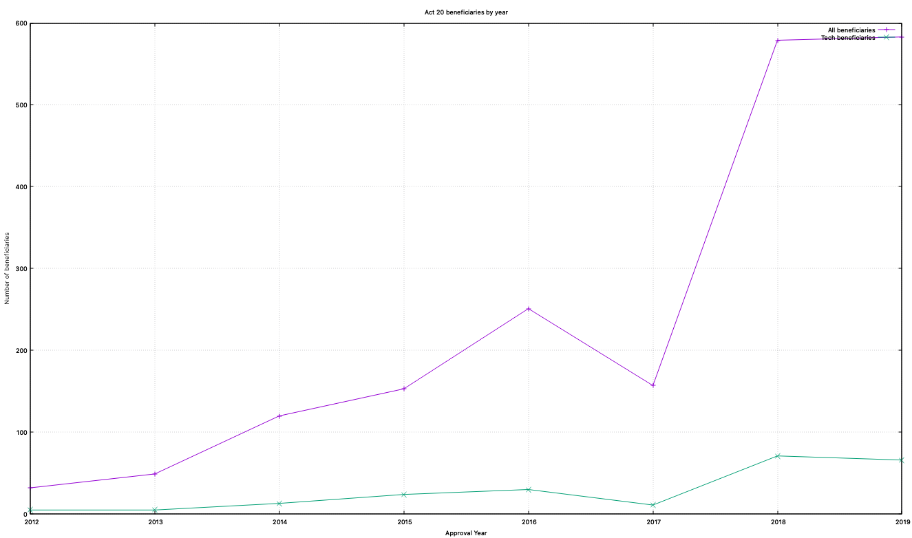

# Act 20

This repository contains scripts analyzing Puerto Rico's Department of Economic Development and Comerce with special attention to Act 20.

## Requirements
* [Ammonite REPL](https://ammonite.io/)
* Scala 2.12.10
* Dataset `beneficiarios.csv` included in repository, [source](https://www.ddec.pr.gov/accesoinfo/#)
* [Gnuplot](http://www.gnuplot.info/) for plotting or running `./plot.sh`

## Usage
In your terminal

``` bash
amm --watch beneficiaries.sc
```

Example output:

```
Running beneficiaries analysis...
=================================
About to process csv beneficiarios.csv
Loaded 10809 rows
A total of 10 incentives exist in Puerto Rico:
	Act 8-1987
	Act 22-2012
	Act 273-2012
	Act 14-2017
	Act 27-2011
	Act 135-1998
	Act 20-2012
	Act 126-1966
	Act 83-2010
	Act 73-2008
A total of 1924 beneficiaries found.
A total of 583 Act 20 beneficiaries approved in 2019.
The following are the number Act 20 recipients by year:
	2012: 32
	2013: 49
	2014: 120
	2015: 153
	2016: 251
	2017: 157
	2018: 579
	2019: 583
Act 20 recipients who's companies fonund in List(engineering, digital, tech, solution, software, data)
	Amplotech
	Banktech, LLC
	Campodata
	Cybersolutions LLC
	Entech Design and Project Management Psc
	Kastech Latam LLC
	Paytech Corp
        ...
Watching for changes to 2 files... (Ctrl-C to exit)
```

Running
```./plot.sh```
Lets you graph the results

